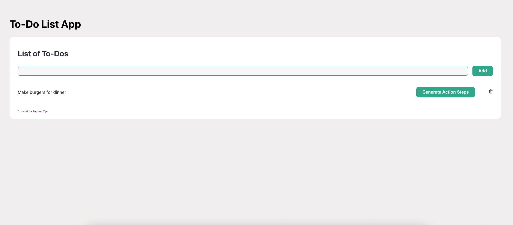
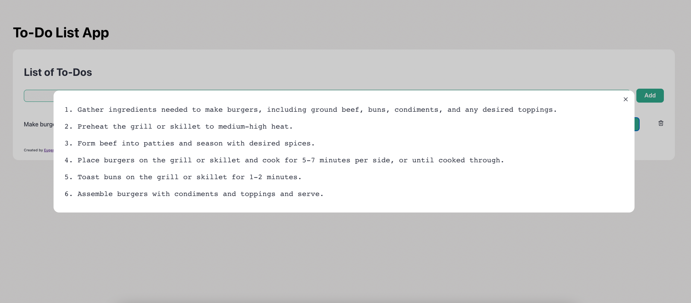

# To-Do List GPT
This is a full-stack to-do list application built using the MERN (MongoDB, Express.js, React.js, Node.js) stack.
You can check it out [here](https://to-do-list-gpt.vercel.app/).





## 🚀 Features
- Create to-dos
- Add to-dos
- Delete to-dos
- Allows user to generate action steps for each individual to-do's

## Prerequisites

Make sure you have the following installed on your machine:
- Node.js
- npm (Node Package Manager)

To see if you already have Node.js and npm installed and check the installed version, run the following commands:

```shell
node -v
npm -v
```

## Installation Guide

1. Clone this repository to your local machine using the following command:
```shell
git clone https://github.com/eugenetye/ToDoListGPT.git
```

### Server
2. Open a terminal or command prompt and navigate to the server directory of the cloned app.
```shell
cd backend
```
3. Install the server-side dependencies by running the following command:
```shell
npm install
```

4. Update the `.env` file using the template given by the `.env.example` file by inserting your own API keys. 
You will need to obtain an API key from OpenAI. More information can be found [here](https://platform.openai.com/docs/introduction). 
You will also need to set up a MongoDB database and use the MongoDB URI to connect to the database. More information can be found [here](https://www.mongodb.com/docs/atlas/tutorial/connect-to-your-cluster/). 
```shell
REACT_APP_PORT= YOUR PORT NUMBER GOES HERE
REACT_APP_MONGO_URI= YOUR MONGO URI GOES HERE
REACT_APP_OPENAI_API_KEY = YOUR API KEY GOES HERE
```

5. Start the server-side of the app by running the following command:
```shell
npm start
```
### Client
6. Open another terminal or command prompt and navigate to the client directory of the cloned app.
```shell
cd client
```
7. Install the client-side dependencies by running the following command:
```shell
npm install
```

8. Start the client-side of the app by running the following command:
```shell
npm start
```

Done! Now open localhost:3000 in your browser and the app should now be running.
